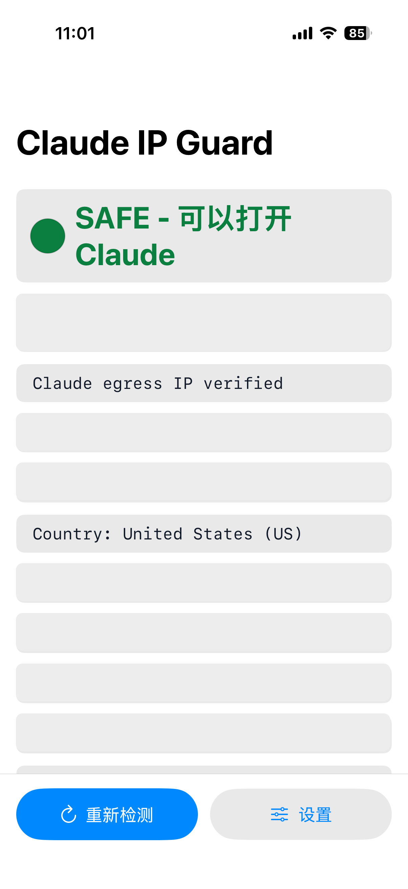
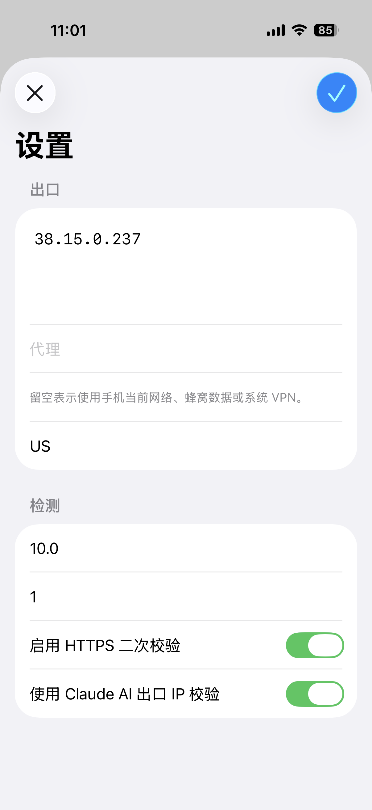

# Claude IP Guard iOS

这是 `ios` 分支，专门放 iPhone 版 Claude IP Guard。

这个版本会在手机上检测当前出口 IP、Claude AI 出口 IP、国家/地区、HTTPS 二次校验和风险信息。只有检测结果符合配置时，才会显示 `SAFE - 可以打开 Claude`。

> `main` 分支是桌面版说明；这个分支的 README 是 iOS 版说明。

## 分支跳转

- 当前：[`ios` 分支，iPhone 版](https://github.com/heliang-pu/claude-ip-guard/tree/ios)
- 桌面版：[`main` 分支，macOS/Linux 版](https://github.com/heliang-pu/claude-ip-guard/tree/main)

## 截图

首页检测通过：



设置页：



## 当前默认设置

iOS 版已经按你的手机使用方式预置：

- 出口 IP：`38.15.0.237`
- 国家/地区：`US`
- 代理：留空

代理留空表示直接使用 iPhone 当前网络，包括蜂窝数据、手机 Wi-Fi 或系统 VPN。手机上跑的时候不依赖 Mac 的本地代理。

## 怎么装到 iPhone

1. 用 Mac 打开 `ios/ClaudeIPGuard/ClaudeIPGuard.xcodeproj`。
2. iPhone 用数据线连接 Mac，并在手机上点信任。
3. Xcode 顶部运行目标选择你的 iPhone。
4. 在 Signing & Capabilities 里选择你的 Apple 开发者 Team。
5. 点运行按钮安装到手机。
6. 第一次打开如果 iPhone 提示信任开发者，到 `设置 -> 通用 -> VPN 与设备管理` 里信任你的开发者证书。

## 使用方式

打开 App 后点 `重新检测`。

看到 `SAFE - 可以打开 Claude` 时，表示当前手机出口 IP 和配置匹配。看到 `UNSAFE` 或 `ERROR` 时，不建议打开 Claude，先检查当前手机网络、VPN 或出口 IP。

点 `设置` 可以修改：

- 出口 IP
- 代理
- 国家/地区
- 超时时间
- 重试次数
- HTTPS 二次校验
- Claude AI 出口 IP 校验

## 本地验证

不用完整 Xcode 也可以先验证 Swift 逻辑：

```bash
cd ios/ClaudeIPGuard
swift run ClaudeIPGuardCoreSmokeTests
swift build --target ClaudeIPGuardApp
```

用 Xcode 命令行构建 iOS 工程：

```bash
cd ios/ClaudeIPGuard
xcodebuild -project ClaudeIPGuard.xcodeproj \
  -scheme ClaudeIPGuard \
  -destination 'generic/platform=iOS' \
  build
```

## 目录结构

- `ios/ClaudeIPGuard/App/`：SwiftUI 界面、设置页、ViewModel 和本地配置存储
- `ios/ClaudeIPGuard/Shared/ClaudeIPGuardCore/`：检测、解析和 SAFE/UNSAFE 判断逻辑
- `ios/ClaudeIPGuard/Tests/`：Swift 核心逻辑 smoke tests
- `docs/ios/`：iOS README 截图

## 说明

这个工具只做出口检测和风险提示，不绕过 Claude 的登录、风控、地区限制、速率限制或任何服务端策略。最终能不能使用 Claude，还是以 Claude 服务端实际判断为准。
