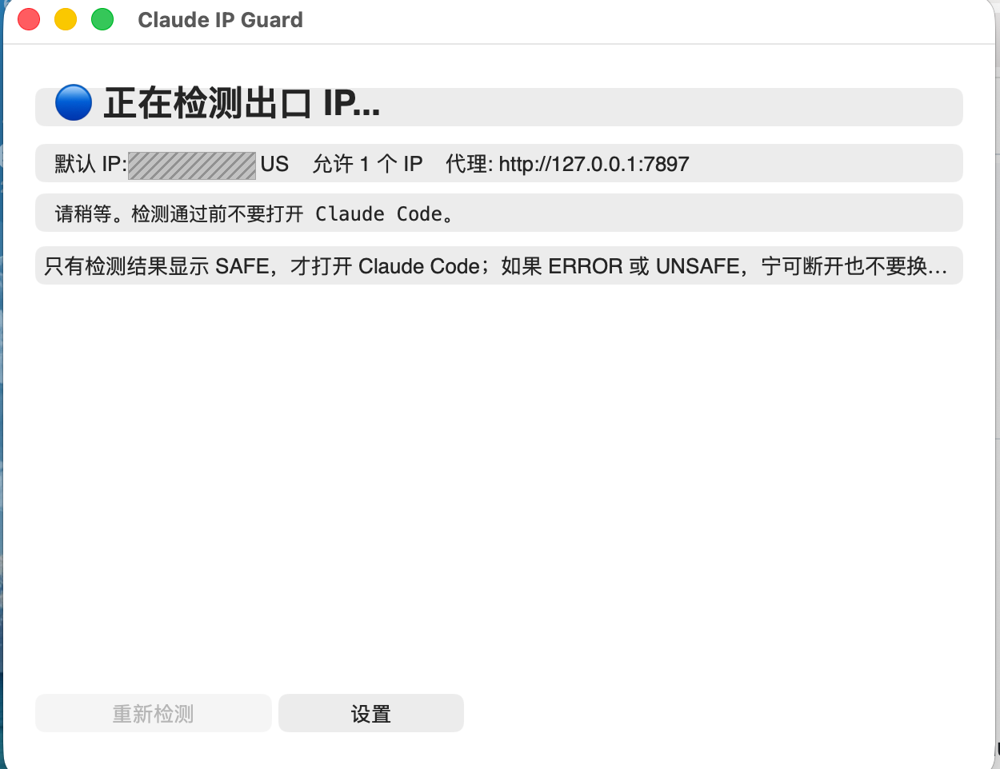
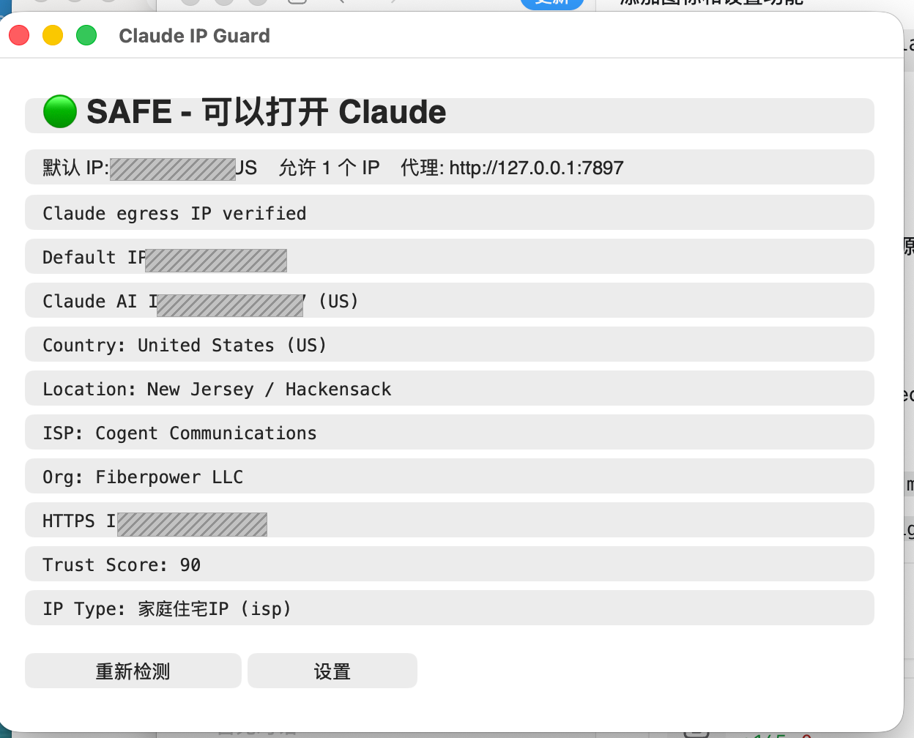

# Claude IP Guard

A lightweight desktop guard that verifies your Claude egress IP, risk score, and proxy safety before opening Claude Code.

Claude IP Guard is intentionally strict: if it cannot prove that your Claude traffic exits through a configured safe IP, it shows `UNSAFE` or `ERROR` so you can avoid opening Claude Code from the wrong network path.

## Screenshots

The public IPs in these screenshots are intentionally masked.

Checking state:



Safe state with IP risk details:



## Features

- Checks the default proxy egress IP.
- Checks the Claude-specific egress IP via `claude.ai/cdn-cgi/trace`.
- Supports one default IP plus multiple allowed fallback IPs.
- Verifies country/region code, such as `US`.
- Optionally verifies HTTPS egress with `ifconfig.me`.
- Shows supplemental IP risk data:
  - Trust Score
  - Residential/datacenter type
  - ASN and ASN organization
  - VPN, proxy, Tor, crawler, and abuse flags
- Includes a small Tkinter desktop UI for macOS and Linux.
- Builds a lightweight macOS `.app` bundle.
- Includes a SwiftUI iOS app under `ios/ClaudeIPGuard/`, with the same app icon as the desktop build.

## When Is It Safe?

Open Claude Code only when the app shows `SAFE - 可以打开 Claude`.

The safest result usually looks like this:

- `Claude AI IP` matches your configured allowed IP.
- Country code matches your expected country, for example `US`.
- `Default IP`, `Claude AI IP`, and `HTTPS IP` are consistent.
- `Trust Score` is high, ideally `80+`.
- `IP Type` is `家庭住宅IP` or another trusted clean static egress.
- `VPN`, `Proxy`, `Tor`, `Crawler`, and `Abuse` are all `no`.

If the app shows `ERROR` or `UNSAFE`, do not open Claude Code until the network/proxy route is fixed.

## Quick Start

Run the desktop UI directly:

```bash
python3 tools/claude_ip_guard_app.py
```

On first launch, click `设置` and replace the placeholder/empty allowed IP list with your own Claude egress IP. Claude IP Guard does not ship with a real safe IP.

The iOS app is currently preconfigured for the author's safe egress IP, `38.15.0.237` in `US`, and uses the phone's current network by default. Change this before relying on it for any other route.

Run the command-line checker:

```bash
python3 tools/claude_ip_guard.py \
  --proxy http://127.0.0.1:7897 \
  --expected-ip 203.0.113.10 \
  --expected-country US
```

Multiple allowed IPs can be separated by commas:

```bash
python3 tools/claude_ip_guard.py \
  --expected-ip "203.0.113.10,203.0.113.11" \
  --expected-country US
```

## Desktop Settings

Click `设置` in the desktop app to configure:

- Proxy URL
- Allowed IPs
- Expected country code
- Timeout
- Retry count
- HTTPS secondary check
- Claude AI egress IP check

The first allowed IP is treated as the default IP. Additional IPs are accepted as safe fallback egresses.

The IP values are fully user-configurable. The repository only uses documentation example IPs such as `203.0.113.10`; replace them with your own fixed Claude egress IP before relying on the check.

Settings are saved locally:

```text
~/.claude-ip-guard/settings.json
```

## Build The App Bundle

Build the macOS app bundle and Linux launcher:

```bash
python3 tools/build_claude_ip_guard_app.py
```

Outputs are written to `dist/`:

- `dist/Claude IP Guard.app`
- `dist/claude-ip-guard-linux/`
- `dist/claude-ip-guard-linux.tar.gz`

`dist/` is ignored by git because these files are generated artifacts.

## Environment Defaults

You can override defaults with environment variables:

```bash
export CLAUDE_IP_GUARD_PROXY="http://127.0.0.1:7897"
export CLAUDE_IP_GUARD_IP="203.0.113.10"
export CLAUDE_IP_GUARD_COUNTRY="US"
```

If `CLAUDE_IP_GUARD_IP` is not set and no desktop settings have been saved, the app will ask you to configure an allowed IP before running a check.

## Development

Run tests:

```bash
pytest -q
```

Compile-check the scripts:

```bash
python3 -m py_compile \
  tools/claude_ip_guard.py \
  tools/claude_ip_guard_app.py \
  tools/build_claude_ip_guard_app.py
```

Check the iOS shared logic and SwiftUI target:

```bash
cd ios/ClaudeIPGuard
swift run ClaudeIPGuardCoreSmokeTests
swift build --target ClaudeIPGuardApp
```

## Data Sources

Claude IP Guard uses several public endpoints during checks:

- `ip-api.com` for default IP geolocation
- `claude.ai/cdn-cgi/trace` for Claude egress IP
- `ifconfig.me` for HTTPS egress confirmation
- `ip.net.coffee` public risk API for supplemental IP risk fields

Risk data is advisory. The final access decision is always up to Claude's own service-side risk controls.

## Disclaimer

This tool does not bypass Claude restrictions, authentication, rate limits, or policy enforcement. It only helps you verify whether your current proxy/egress route matches the IP profile you intend to use before opening Claude Code.
